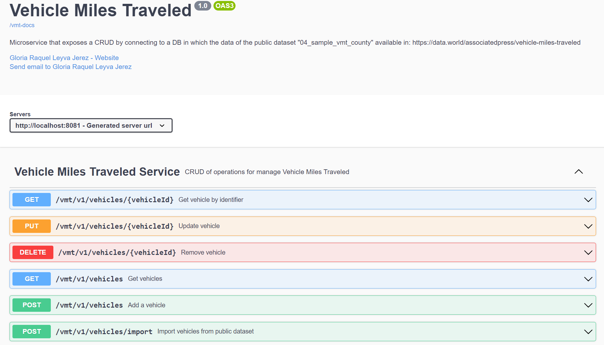

# VEHICLE MILES TRAVELED MICROSERVICE
En este ejercicio desarrollo un microservicio que expone un CRUD conectando a una BD en la que previamente se cargan los datos del dataset público "04_sample_vmt_county.csv" disponible en: https://data.world/associatedpress/vehicle-miles-traveled. 
La API fue documentada con `Open API` y testeada con `Postman`. Se implementarions pruebas unitarias y de integración con `JUnit` y `Mockito`.
Se empleó una arquitectura hexagonal siguiendo `Domain Driver Design` y se aplicaron patrones como Adapter, Repositorios entre otros. 
Para optimizar las consultas se emplea `HATEOAS` con `Paginación`, compresión `gzip` y se ha habilitado `HTTP2`.

Ruta de la documentación de swagger: `http://localhost:8081/vmt-demo-api-docs`

### Instalación y despliegue
1. Descargar el proyecto e importarlo. Puede clonarlo desde: `https://github.com/grleyvaj/vehicle-miles-traveled-service.git`
2. `Intellij IDEA` como IDE de desarrollo. Descargar [aquí](https://www.jetbrains.com/es-es/idea/download/).
3. PostgreSQL. Configurar base de datos, puerto y host en `aplication.properties`
4. `Postman` para probar los endpoint de las APIs. Descargar [aquí](https://www.postman.com/downloads/).
    El directorio `postman` contiene el archivo `Vehicle Miles Traveled.postman_collection.json` con todas las request de los endpoints implementados.
5. `MAVEN` para gestionar las dependencias. Descargar [aquí](https://maven.apache.org/download.cgi/).
   El `pom/xml` contiene todas las dependencias que deben ser descargadas para el despliegue de este proyecto.

### Descripción del ejercicio práctico
1. Se recomienda realizar una llamada al endpoint de importación para importar todos los datos del dataset y así poblar la base datos y luego consultar los endoints del CRUD presentado. 

    El directorio `postman` contiene el archivo `Vehicle Miles Traveled.postman_collection.json` con todas las request de los endpoints implementados.

2. Endpoints implementados:

   POST `/vmt/v1/vehicles/import` Importar dataset para previamente cargar los datos. Se deberá descargar previamente el dataset o emplear el que ha sido previamente descargado y se encuentra en el directorio de resorce : `\vehicle-miles-traveled-service\src\main\resources\04_sample_vmt_county.csv`. El endpoint retorna el listado de todos los kms de vehículos importados (de cada vmt se seleccionan algunos datos para listar). 
   
   
   GET `/vmt/v1/vehicles` Listar todos los datos de todos los vehículos. Puede indicar paginación `/vmt/v1/vehicles?page=0&size=5&sort=id,asc`. 
    
    
   GET `/vmt/v1/vehicles/{vehicleId}` Obtener los datos del vehículo especificado mediante su identificador `vehicleId`. Ejemplo: `/vmt/v1/vehicles/1`. La implementación de este endpoint contiene el manejo de excepciones para el caso en el que se solicite un vehículo que no se encuentra registrado.
   
        
   POST `/vmt/v1/vehicles` Crear vehículo. La implementación de este endpoint contiene el manejo de excepciones para las validaciones que se aplican al VehicleRequest.
   
   
   PUT `/vmt/v1/vehicles/{vehicleId}` Actualizar vehículo. La implementación de este endpoint contiene el manejo de excepciones para las validaciones que se aplican al VehicleRequest, y para el manejo de la excepción cuando se especifica un vehículo para actualizar que no se encuentra registrado.
   
   
   DELETE `/vmt/v1/vehicles/{vehicleId}` Eliminar vehículo.
   

3. Para un mejor entendimiento y además realizar pruebas, una vez que el proyecto se encuentra corriendo/levantado, se puede consultar la documentación, enlace: http://localhost:8081/vmt-demo-api-docs

    

### Archivos y clases puntuales
- archivo `application.properties` contiene las configuraciones del proyecto como DB, encoding, ruta para open-api, etc.
- las clases `Documentation` almacenan la documentación, es para simplificar las clases controladoras, dejarlas con el mínimo de doc swagger.
- la clase `URIConstant` es donde he definido las URI del proyecto, para si en un futuro se desean cambiar, ir solo a este archivo en lugar de cada API.
- la clase `VehicleMilesTraveledApiController` es el controlador con la implementación de los endpints.
- la clase `VehicleMilesTraveledOpenApi` es el contrato de la api que contiene las anotaciones para especificar/documentar los endpoints empleando Open Api.
- los servicios se encuentran dividos por casos de uso (domain/use_ase), donde cada caso de uso responde a cada uno de los requerimientos/HU planteados en el CRUD presentado.

### Pruebas 
Se implementaron pruebas automatizadas de unidad y de integración empleando `Junit` y `Mockito`

# OTROS EJERCICIOS
En mi perfil (https://github.com/grleyvaj) se pueden encontrar otros ejercicios que he implementado con otras tecnologías como bases de datos en memoria como `redis`, no relacionales como `h2` y `mongodb`, relacional como `mysql`, donde también he empleado anotaciones para la inyección de dependencias (@Services, @Component, @Repository), he implementado validadores, convertidores, adaptadores, etc. 
Puede consultar los ejercicios:

- `APIsRest_Liga` (https://github.com/grleyvaj/APIsREST_Liga), 
- `APIsREST_Tweets` (https://github.com/grleyvaj/APIsREST_Tweets), 
- `soee-manage-user-backend` (https://github.com/grleyvaj/soee-manage-user-backend)
... entre otros

Podrá encontrar ejemplos de filtrado por campos disponibles y búsqueda por cadena de texto entre otras operaciones, y ejemplos de aplicación de arquitectura MVC.